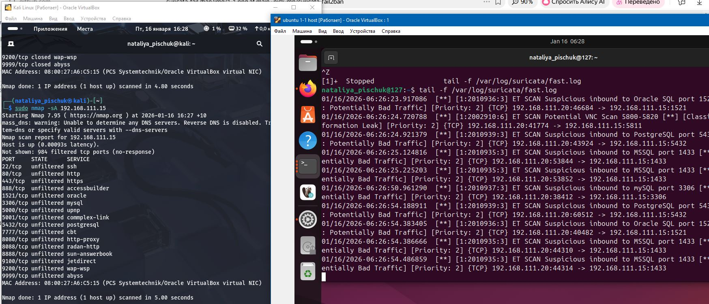
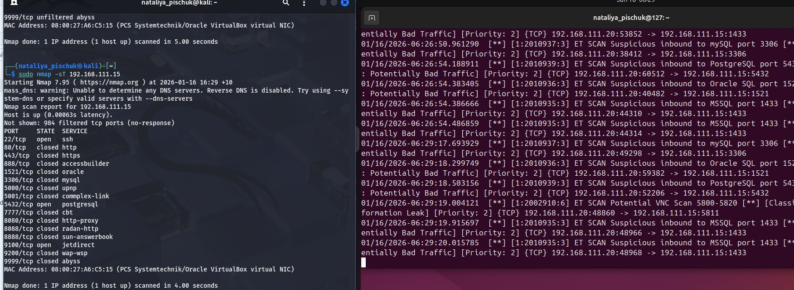
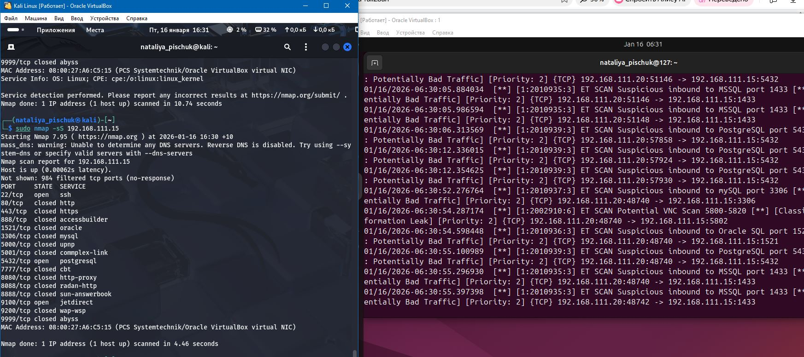
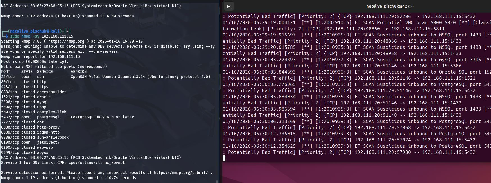
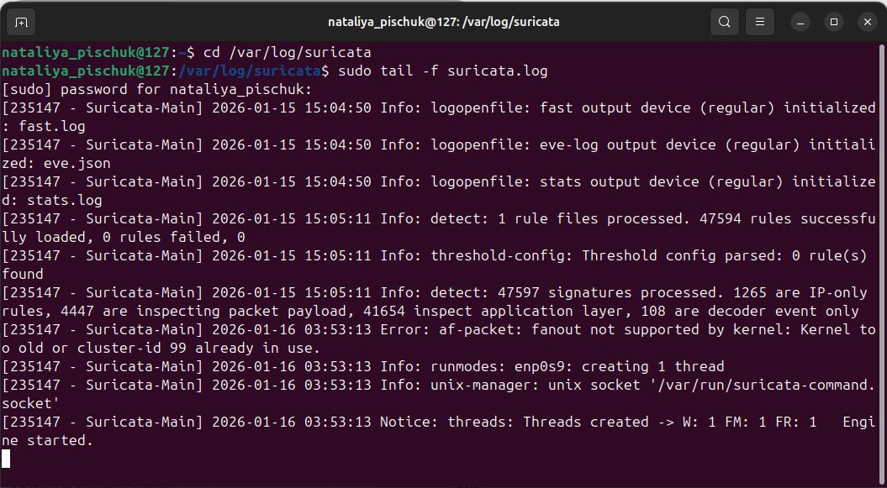
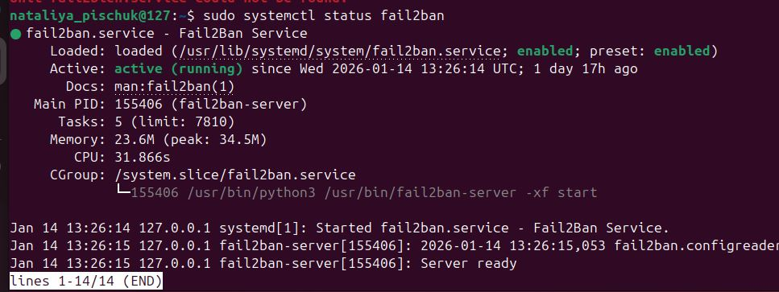
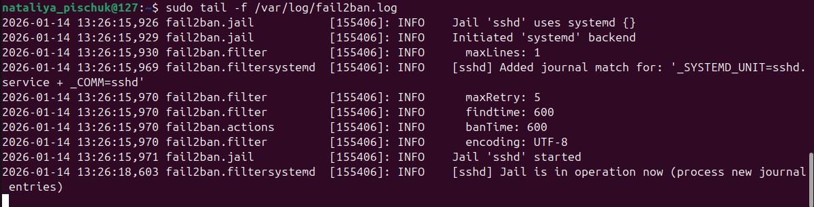

# Домашнее задание к занятию «Защита сети»
## Подготовка к выполнению заданий
Подготовка защищаемой системы:
- установите Suricata,
- установите Fail2Ban.
Подготовка системы злоумышленника: установите nmap и thc-hydra либо скачайте и установите Kali linux.
Обе системы должны находится в одной подсети.

###  Задание 1
Проведите разведку системы и определите, какие сетевые службы запущены на защищаемой системе:

sudo nmap -sA < ip-адрес >

sudo nmap -sT < ip-адрес >

sudo nmap -sS < ip-адрес >

sudo nmap -sV < ip-адрес >

По желанию можете поэкспериментировать с опциями: https://nmap.org/man/ru/man-briefoptions.html.

В качестве ответа пришлите события, которые попали в логи Suricata и Fail2Ban, прокомментируйте результат

###  Решение 1
Использую две виртуальные машины
Kali 192.168.111.20 и Ubuntu 192.168.111.15

Suricata сработал везде, кроме первого запроса -sA. В остальных же случаях лог Suricata выдает, что происходило подозрительное скарирование и классификация идет как "Потенциально опасный трафик" и "Возможна утечка информации".
#### sudo nmap -sA 192.168.111.15

#### sudo nmap -sT 192.168.111.15

#### sudo nmap -sS 192.168.111.15

#### sudo nmap -sV 192.168.111.15

Fail2Ban во всех случаях не реагировал

